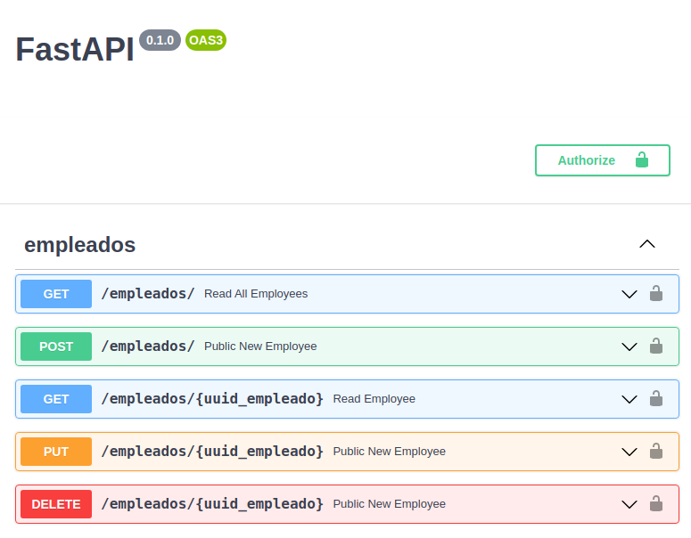

# migration-test: Technical test

author: `Alejandro Bravo`

email: `bravotorres.alejandro@gmail.com`

Bassed on Challene of `alfaro28` in [comerciosempleados](https://github.com/alfaro28/comerciosempleados). 

### Disclaimer
There is much to say about it.
On security issues, error handling, data persistence layer management and schemas (blessed schemas). However, my proposal is a small example.
I still have work to do.

## Documents
Can you see the Swagger YAML Documentation copy in `docs/openapi.yaml` file.
And post run the application, can you consult the endpoint `/docs` for local testing. Maybe have a more ToDos to fix this mode to test...




## Deploy

I used a reply to de DB Base to maintain a portability of data.

### Develop/Local Environment
- To install dependencies, required `Python 3.8.x` and dotEnv file `.env_{dev,qa,prod}` according to the case. (See [Appendix I](##Appendix-I:-DotEnv-file))
```shell
$ python -m venv venv
$ source venv/bin/activate
(venv) $ pip install pip -U && pip install -r requirements.txt
````
- Run application
```shell
(venv) $ python main.py
```

### Docker
I configured and suggest a base image in RedHat to Deploy a python applications in a kubernetes cluster to microservices.
To obtain a more optimal performance in time and memory, considered a docker image based in Alpine
But I have much more to tell about this...

- To build docker image
```shell
$ docker build -t python-challenge -f .Docker/Dockerfile .
```

- Create and run container from image  `python-challenge` in port  `9000`.  
  
```shell  
$ docker run --name challenge -ti -p 9000:8080 -d python-challenge
```


### Appendix I: DotEnv file
```dotEnv
ENVIRONMENT = "dev"
DEBUG = True
SERVER_HOST = "0.0.0.0"
SERVER_PORT = 8001

TITLE = "Dapp Test"
DESCRIPTION = "App migration, basic config and endpoints."

PROJECT_NAME = "Dapp Test: Employees"
PROJECT_VERSION = "0.0.1"

API_BASE_PATH = "/migration/v1"
API_NAME = "Migration"

# Test Case Database = Only for challenges or testing
DATABASE_STRING = "sqlite:///./db.sqlite3"
```
